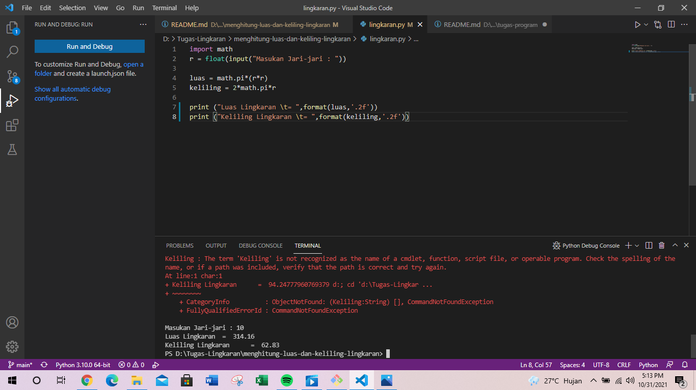

# menghitung-luas-dan-keliling-lingkaran
## Berikut prorgam python nya dan flowchart 
### dengan menggunakan vscode
kita akan menjalankan program pyhton ini di vscode,Rumus luas dan keliling lingkaran yang di gunakan adalah:

    Luas     = π × r²
    Keliling = 2 x π × r

Nilai Phi yang akan kita gunakan adalah 10
r merupakan jari-jari lingkaran

Phi merupakan nilai konstanta di matematika sementara jari-jari merupakan jarak antara titik pusat dengan tepi lingkaran. Sebetulnya ada rumus lain untuk menghitung keliling lingkaran yaitu dengan menggunakan diameter, tapi pada kasus ini kita cukup menggunakan jari jari lingkaran saja.

Berikut contoh program dan script nya nya:

    import math
    r = float(input("Masukan Jari-jari : "))

    luas = math.pi*(r*r)
    keliling = 2*math.pi*r

    print ("Luas Lingkaran \t= ",format(luas,'.2f'))
    print ("Keliling Lingkaran \t= ",format(keliling,'.2f'))

berikut untuk output nya:

    
    Masukan Jari-jari : 10
    Luas Lingkaran          =  314.16
    Keliling Lingkaran      =  62.83

Dengan penggunaan fungsi format(luas,’.2f’) akan menghasilkan 2 angka pecahan saja.

Flowchart Menghitung Luas & Keliling Lingkaran:

dan itulah contoh program menghitung luas dan keliling lingkaran kurang lebih nya terimakasih.
